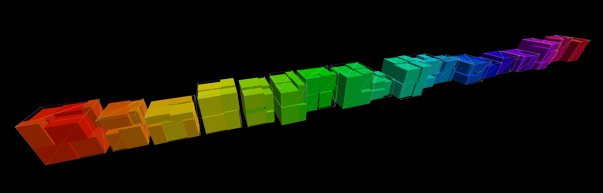

# rendercube

Renders [SardineCan](https://github.com/merschformann/sardine-can) solutions stored in JSON via Three.js as a self-contained HTML file.

> **Note:** This is a work in progress with very limited functionality.

## Installation

```bash
go install github.com/merschformann/rendercube@latest
```

## Usage

```bash
rendercube -input <input.json> -output <output.html>
```

## Example

Find an example solution rendered in the screenshot below:


